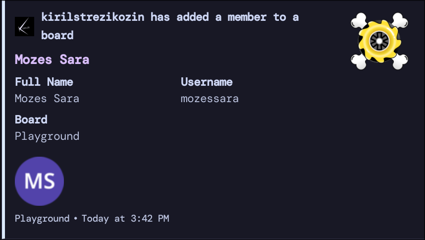
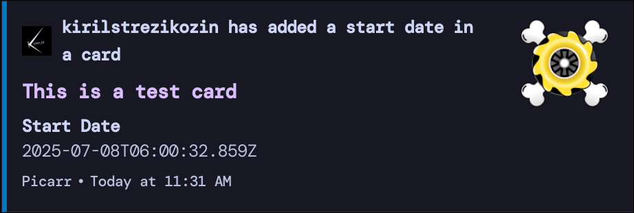
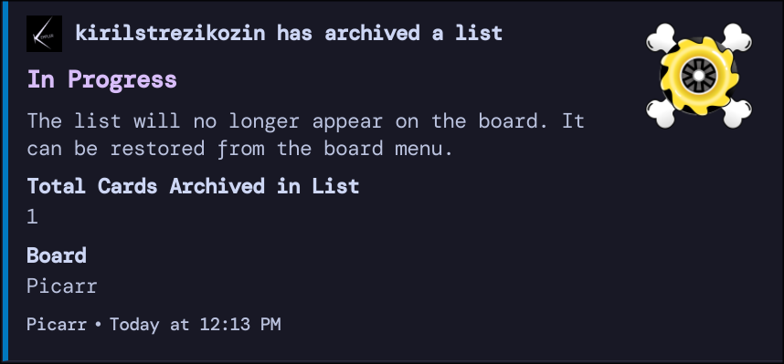
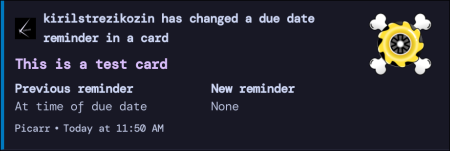
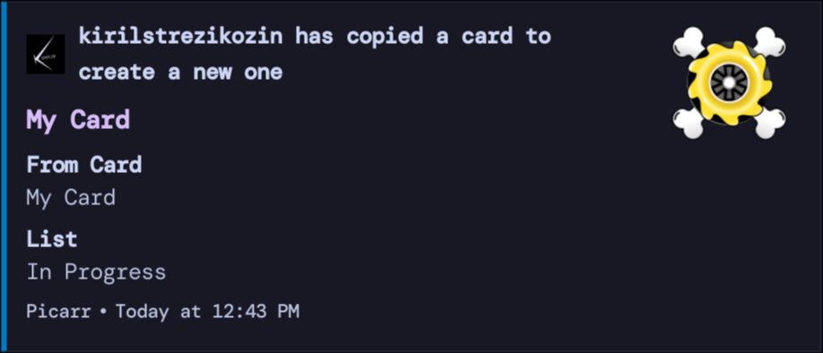
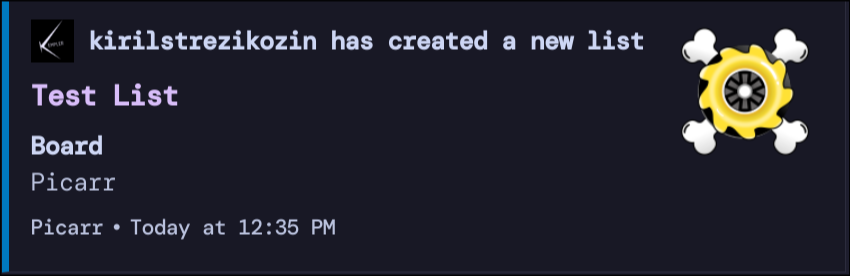
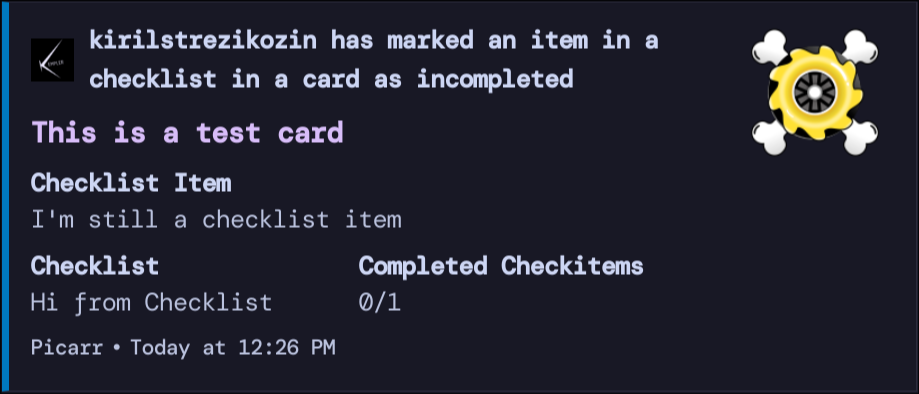
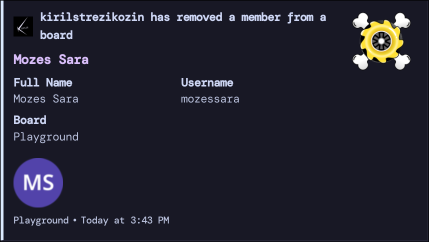
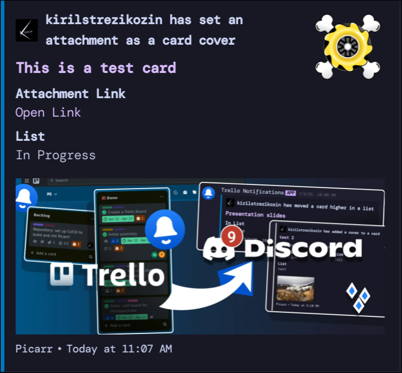

<p align="center">
    
</p>

# Trello Activity Notifications in Discord

<p align="center">
    
</p>

## About

Get Trello activity updates directly in Discord. This is a bot that sends clear, real-time notifications when, for example, someone adds or edits a card — no more digging through Trello emails to stay updated on your project or your teammates' progress.

Built with TypeScript, using [Next.js](https://nextjs.org), [Discord.js](https://discord.js.org/), [Zod](https://zod.dev/), and the [Trello API](https://developer.atlassian.com/cloud/trello/).


## Table of Contents

- [About](#about)
- [Features](#features)
    - [List of Supported Activity Types](#list-of-supported-activity-types)
- [Limitations](#limitations)
- [Quick Start](#quick-start)
    - [Get Credentials](#get-credentials)
        - [Trello](#trello)
        - [Discord](#discord)
    - [Test Run](#test-run)
    - [Deploy](#deploy)
        - [Development](#development)
        - [Production](#production)
    - [Running Unit Tests](#running-unit-tests)
- [Contributing](#contributing)
- [Donate](#donate)
- [License](#license)

## Features

- **Completely free, no subscription or limited number of notifications per month.**
- **75 unique Trello activity types to report to Discord.**
- **Beautiful, detailed Discord messages with preview images, colors.**

    

- Real-time notifications, limited only by your network.
- Fast. Less than 10ms to parse a payload from Trello and find what activity type it matches.
- Host once, serve multiple Trello users or models (boards).
- Message accent color matches your Trello board's color.
- The largest and most up-to-date collection of documented Trello [activity types](https://gitlab.com/KirilStrezikozin/discord-trello-activity-app/-/tree/main/src/lib/trello/action/types) and their [example payloads](https://gitlab.com/KirilStrezikozin/discord-trello-activity-app/-/tree/main/test/lib/trello/action/types/_payloads).
- Extendable, modular codebase. Easy to add support for new activity types, make adjustments, control behavior.

### List of Supported Activity Types

<details>
<summary>There are 75 entries with images, click to expand.</summary>

<details open>
<summary>1. AddAttachmentToCard.</summary>

</details>

<details>
<summary>2. AddCheckListToCard.</summary>

</details>

<details>
<summary>3. AddLabelToCard.</summary>

</details>

<details>
<summary>4. AddMemberToBoard.</summary>

</details>

<details>
<summary>5. AddMemberToCard.</summary>

</details>

<details>
<summary>6. AddedCardCover.</summary>

</details>

<details>
<summary>7. AddedCardDueDate.</summary>

</details>

<details>
<summary>8. AddedCardStartDate.</summary>

</details>

<details>
<summary>9. ArchivedCard.</summary>

</details>

<details>
<summary>10. ArchivedList.</summary>

</details>

<details>
<summary>11. ChangedCardCover.</summary>

</details>

<details>
<summary>12. ChangedCardCoverProperties.</summary>

</details>

<details>
<summary>13. ChangedCardDueDate.</summary>

</details>

<details>
<summary>14. ChangedCardDueDateReminder.</summary>

</details>

<details>
<summary>15. ChangedCardStartDate.</summary>

</details>

<details>
<summary>16. ChangedDescriptionOfBoard.</summary>

</details>

<details>
<summary>17. ChangedDescriptionOfCard.</summary>

</details>

<details>
<summary>18. ClosedBoard.</summary>

</details>

<details>
<summary>19. CommentOnCard.</summary>

</details>

<details>
<summary>20. CompletedCheckItem.</summary>

</details>

<details>
<summary>21. ConvertToCardFromCheckItem.</summary>

</details>

<details>
<summary>22. CopyCard.</summary>

</details>

<details>
<summary>23. CopyCheckList.</summary>

</details>

<details>
<summary>24. CopyCommentFromCard.</summary>

</details>

<details>
<summary>25. CreateCard.</summary>

</details>

<details>
<summary>26. CreateCheckItem.</summary>

</details>

<details>
<summary>27. CreateLabel.</summary>

</details>

<details>
<summary>28. CreateList.</summary>

</details>

<details>
<summary>29. DeleteAttachmentFromCard.</summary>

</details>

<details>
<summary>30. DeleteCard.</summary>

</details>

<details>
<summary>31. DeleteComment.</summary>

</details>

<details>
<summary>32. DeleteLabel.</summary>

</details>

<details>
<summary>33. DeleteList.</summary>

</details>

<details>
<summary>34. DeletedCheckItem.</summary>

</details>

<details>
<summary>35. DisablePlugin.</summary>

</details>

<details>
<summary>36. EmailCard.</summary>

</details>

<details>
<summary>37. EnablePlugin.</summary>

</details>

<details>
<summary>38. MakeAdminOfBoard.</summary>

</details>

<details>
<summary>39. MakeNormalMemberOfBoard.</summary>

</details>

<details>
<summary>40. MarkedCardComplete.</summary>

</details>

<details>
<summary>41. MarkedCardIncomplete.</summary>

</details>

<details>
<summary>42. MarkedCheckItemIncomplete.</summary>

</details>

<details>
<summary>43. MoveCardFromBoard.</summary>

</details>

<details>
<summary>44. MoveCardFromListToList.</summary>

</details>

<details>
<summary>45. MoveCardToBoard.</summary>

</details>

<details>
<summary>46. MoveListFromBoard.</summary>

</details>

<details>
<summary>47. MoveListToBoard.</summary>

</details>

<details>
<summary>48. MovedCardHigher.</summary>

</details>

<details>
<summary>49. MovedCardLower.</summary>

</details>

<details>
<summary>50. MovedCheckItemHigher.</summary>

</details>

<details>
<summary>51. MovedCheckItemLower.</summary>

</details>

<details>
<summary>52. MovedListLeft.</summary>

</details>

<details>
<summary>53. MovedListRight.</summary>

</details>

<details>
<summary>54. RemoveCheckListFromCard.</summary>

</details>

<details>
<summary>55. RemoveLabelFromCard.</summary>

</details>

<details>
<summary>56. RemoveMemberFromBoard.</summary>

</details>

<details>
<summary>57. RemoveMemberFromCard.</summary>

</details>

<details>
<summary>58. RemovedCardDueDate.</summary>

</details>

<details>
<summary>59. RemovedCardStartDate.</summary>

</details>

<details>
<summary>60. RemovedVoteFromCard.</summary>

</details>

<details>
<summary>61. RenamedBoard.</summary>

</details>

<details>
<summary>62. RenamedCard.</summary>

</details>

<details>
<summary>63. RenamedCheckItem.</summary>

</details>

<details>
<summary>64. RenamedCheckList.</summary>

</details>

<details>
<summary>65. RenamedList.</summary>

</details>

<details>
<summary>66. ReopenedBoard.</summary>

</details>

<details>
<summary>67. RestoredCard.</summary>

</details>

<details>
<summary>68. RestoredList.</summary>

</details>

<details>
<summary>69. SetAttachmentAsCardCover.</summary>

</details>

<details>
<summary>70. UnsetAttachmentAsCardCover.</summary>

</details>

<details>
<summary>71. UpdateCardLabels.</summary>

</details>

<details>
<summary>72. UpdateComment.</summary>

</details>

<details>
<summary>73. UpdateLabelColor.</summary>

</details>

<details>
<summary>74. UpdateLabelName.</summary>

</details>

<details>
<summary>75. VoteOnCard.</summary>

</details>

</details>

## Limitations

- Manual hosting, not a one-click-enable Power-Up for Trello (this bot would be paid otherwise). **But** you can utilize the method presented in [Test Run](#test-run) if you use case is lightweight.
- Like similar paid solutions, this bot is made to report activity that occurs on Trello boards only. This includes adding members, enabling plugins, doing anything with Trello boards, lists, and cards (covers, attachments, checklists, labels, fields). This is probably what you expect anyway.

## Quick Start

This bot sends descriptive notifications to a Discord channel whenever activity occurs in Trello. You can run this bot locally on your machine or in the cloud (hosted). The setup is minimal, and is mostly about getting and setting credentials. Follow the guide below.

First, let's get an idea of how the bot functions. Its communication chain can be outlined like this:

0. Activity happened in a Trello board (triggered by a board member or plugin).
1. Trello sends a payload with activity data to a **webhook** you set up.
2. The webhook app processes activity data and builds a Discord message.
3. Lastly, it **sends the message** to a channel in Discord.

Highlighted in bold is what needs to be configured with your credentials, the rest is handled.

### Get Credentials

Bot needs credentials to fetch additional Trello data to build more descriptive messages, to verify that it receives data from a legitimate source, and to be able to send a message to Discord. Do not share the secrets you generate in this guide with anyone.

#### Trello

1. **Trello API key.**

To generate a Trello API key, you first need to have created a Trello Power-Up. Follow [this official Trello guide](https://developer.atlassian.com/cloud/trello/guides/power-ups/managing-power-ups/), section _"Adding a New Custom Power-Up"_. Skip the "IFrame connector URL" and "Capabilities" sections. Then, visit [https://trello.com/power-ups/admin](https://trello.com/power-ups/admin), navigate to the Power-Up you have just created, then "API Key" tab and select the option "Generate a new API Key".

2. **Trello secret.**

On the same "API Key" tab, you can copy the "Secret" value from its field.

3. **Trello token.**

In the description box next to the "API key" field, there is a hyperlink that says "manually generate a Token". Click on it and follow the instructions to generate a token.

#### Discord

You'll need a Discord Webhook URL, which allows sending messages to a channel.

Go to a server you can manage, select a channel of your choice. Go to its settings.


From there, select "Integrations" -> "Create Webhook". Click on the newly created webhook, and press "Copy Webhook URL".


#### Trello Board ID

You will need the ID of a Trello board you want the bot to listen to activity on. You can get one by first exporting your board data as JSON by clicking on the "Export as JSON" button in the board menu in Trello:


Then open the exported JSON file, and copy the first `id` value, this is the board ID:


### Test Run

You can try this bot for a quick spin before considering any full-scale deployment using a public bot URL pre-hosted for this purpose. Please avoid abuse, or this option will disappear. Prepare all the credentials you acquired in the previous steps.

In the terminal using, for example, `curl`, run:

```bash
curl -X POST -H "Content-Type: application/json" \
"https://api.trello.com/1/tokens/<YOUR_TRELLO_TOKEN>/webhooks/" \
-d '{
  "key": "<YOUR_TRELLO_API_KEY>",
  "callbackURL": "https://discord-trello-activity.vercel.app/api?webhookURL=<DISCORD_WEBHOOK_URL>&apiKey=<YOUR_TRELLO_API_KEY>&secret=<YOUR_TRELLO_SECRET>&token=<YOUR_TRELLO_TOKEN>",
  "idModel":"<YOUR_TRELLO_BOARD_ID>",
  "description": "Trello Activity Notifications in Discord (Test Run)"
}'
```

Because you are using `DISCORD_WEBHOOK_URL` as a URL search parameter here, and not environment variable, like you could in [Development](#development) or [Production](#production), first URL-encode it with, for example, [this tool](https://www.urlencoder.org/).

Next, jump to the Trello board the ID of which you used in `YOUR_TRELLO_BOARD_ID`, and perform any action. You should see a Discord message arrive quickly.

### Deploy

#### Development

If you want to run the bot locally on your machine (for example, during development, for temporary runs or testing). Otherwise, go to the [Production](#production) section.


1. Clone this repo:

```bash
git clone https://gitlab.com/KirilStrezikozin/discord-trello-activity-app.git
cd discord-trello-activity-app
```

2. Create a `.env` file and paste the values of the necessary credentials:

```bash
# .env file

# Must-have:
DTAA_TRELLO_API_KEY=<YOUR_TRELLO_API_KEY>
DTAA_TRELLO_TOKEN=<YOUR_TRELLO_TOKEN>
DTAA_TRELLO_SECRET=<YOUR_TRELLO_SECRET>
DTAA_DISCORD_WEBHOOK_URL=<DISCORD_WEBHOOK_URL>

# Optional (you can just copy the values below):

# Image URL to use as thumb icon for Discord messages.
DTAA_DISCORD_MSG_THUMB_URL=

# Whether to report server errors to Discord (nice error messages).
DTAA_WEBHOOK_SEND_ERRORS_TO_DISCORD=1

# Whether to suppress server errors, such as activity parsing issues.
# It is better to report an issue instead.
DTAA_WEBHOOK_SUPPRESS_ERRORS=0

# Log no debug information.
DTAA_NDEBUG=1

# Enable /api/proxy server endpoint. Enable to have attachment, card cover
# image previews attached to Discord messages.
DTAA_USE_PROXY=1

# Optionally hard-code the URL your bot is hosted at.
# This can also be the public forward URL of your tunnel.
DTAA_ORIGIN_URL=

# Do not send any Discord messages. Useful when just testing parsing.
DTAA_NO_DISCORD_MSGS=1
```

3. Start a development server. Run:

```bash
npm run dev
# or
yarn dev
# or
pnpm dev
# or
bun dev
```

Check whether the bot is running by visiting `http://localhost:3000` in your browser. You should see a static welcome page similar to [this one](https://discord-trello-activity.vercel.app/).

4. Your locally running server needs to be publicly accessible. You can use a tunnel. For example, with [`ngrok`](https://ngrok.com/), run:

```bash
ngrok http 3000 # 3000 is the default port number for Next.js
```

Copy the Ngrok forward URL.

#### Production

[](https://vercel.com/new/clone?repository-url=https%3A%2F%2Fgitlab.com%2FKirilStrezikozin%2Fdiscord-trello-activity-app)

1. You can use the [Vercel Platform](https://vercel.com/) or similar to deploy this bot. See [Next.js deployment documentation](https://nextjs.org/docs/app/building-your-application/deploying) for details.

2. You can configure bot behavior using environment variables. The way to set those will depend on the platform you use for deploying. Below is the standard format of the `.env` file for the bot with the necessary credentials:

```bash
# .env file

# Must-have:
DTAA_TRELLO_API_KEY=<YOUR_TRELLO_API_KEY>
DTAA_TRELLO_TOKEN=<YOUR_TRELLO_TOKEN>
DTAA_TRELLO_SECRET=<YOUR_TRELLO_SECRET>
DTAA_DISCORD_WEBHOOK_URL=<DISCORD_WEBHOOK_URL>

# Optional (you can just copy the values below):

# Image URL to use as thumb icon for Discord messages.
DTAA_DISCORD_MSG_THUMB_URL=

# Whether to report server errors to Discord (nice error messages).
DTAA_WEBHOOK_SEND_ERRORS_TO_DISCORD=1

# Whether to suppress server errors, such as activity parsing issues.
# It is better to report an issue instead.
DTAA_WEBHOOK_SUPPRESS_ERRORS=0

# Log no debug information.
DTAA_NDEBUG=1

# Enable /api/proxy server endpoint. Enable to have attachment, card cover
# image previews attached to Discord messages.
DTAA_USE_PROXY=1

# Optionally hard-code the URL your bot is hosted at.
# This can also be the public forward URL of your tunnel.
DTAA_ORIGIN_URL=

# Do not send any Discord messages. Useful when just testing parsing.
DTAA_NO_DISCORD_MSGS=1
```

### Create a Trello webhook

You can follow [this official Trello guide](https://developer.atlassian.com/cloud/trello/guides/rest-api/webhooks/) or execute the command below (note that values between `<` and `>` need to be replaced):

```bash
curl -X POST -H "Content-Type: application/json" \
"https://api.trello.com/1/tokens/<YOUR_TRELLO_TOKEN>/webhooks/" \
-d '{
  "key": "<YOUR_TRELLO_API_KEY>",
  "callbackURL": "<COPIED_NGROK_URL>/api",
  "idModel":"<YOUR_TRELLO_BOARD_ID>",
  "description": "Trello Activity Notifications in Discord"
}'
```

After executing the `curl` command above, you should see the first `HEAD` requests to your running development server accepted with `200 OK`. This is a sign that the Trello webhook has been successfully set up. The bot is now ready to process activity happening in Trello and send Discord messages.

### Running Unit Tests

Tests exist for activity types, including parsing a mocked JSON payload, checking for overlaps with other action types, verifying built Discord message content. You can run tests with, for example, `npm` (`codegen` is an automated step to collect all implemented activity types):

```bash
npm run codegen && npm run test
```

## Contributing

If you are interested in improving this bot, help tackle issues or add new features, you are welcome!

- You can open an [issue](https://gitlab.com/KirilStrezikozin/discord-trello-activity-app/-/issues/new) or a [merge request](https://gitlab.com/KirilStrezikozin/discord-trello-activity-app/-/merge_requests/new) with the changes you would like to propose.
- If you have a feature request, open an [issue](https://gitlab.com/KirilStrezikozin/discord-trello-activity-app/-/issues/new) and describe what you would like to see implemented.
- If you found a bug, please open an [issue](https://gitlab.com/KirilStrezikozin/discord-trello-activity-app/-/issues/new) with an explanation of how to reproduce it. I will do my best to fix it ASAP.
- If you have other ideas, send an email to [kirilstrezikozin@gmail.com](mailto:kirilstrezikozin@gmail.com).

## Donate

If this bot helps you a lot, or you learned from its codebase, you can support its maintenance by donating to [my PayPal account](https://www.paypal.com/paypalme/kemplerart).

## License

Licensed under the [MIT License](https://opensource.org/license/mit), Copyright © 2025 Kiril Strezikozin. See [LICENSE](LICENSE).
